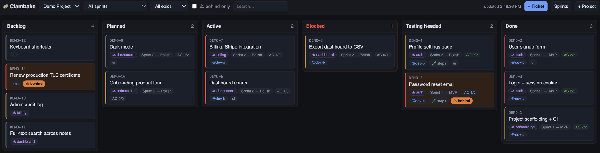
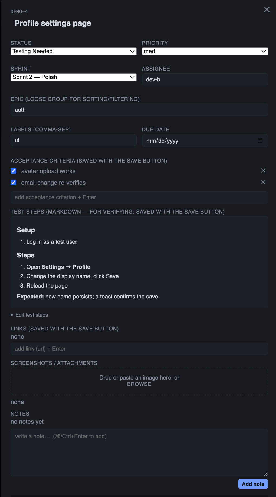

# 🦪 Clambake

A lite-JIRA board for tracking an **AI agent's** active / planned / done / testing-needed work
across any project. Built to fill the gaps when an agent runs a large, multi-step project:
it forgets parked work, loses where details landed, and re-digs whether tests passed.
Clambake gives that state a home you can see in your browser.

- **The agent** opens tickets (with acceptance criteria), moves them across the board, adds notes,
  links PRs — via a small CLI or by editing files.
- **You** watch it live in the browser: drag cards between columns, add notes, check off AC, add tickets,
  spot tickets that fell behind.
- Drops into **any** project — it's a standalone tool with no coupling to what it tracks.



Click any card to open its detail — status, sprint, epic, acceptance criteria, markdown
test steps, screenshots, and notes:

<p align="center"></p>

## Run

```bash
npm install
npm start
# open http://localhost:3000   (set PORT to change)
```

First run ships a **`demo`** project so the board isn't empty. Create your own with the
`+ Project` button or `node cli.js newproject <slug>`.

### Phone / other devices on your home network

The server binds all interfaces, so on startup it prints a `on your phone:` URL like
`http://192.168.1.x:3000` — open that on any device on the **same Wi-Fi**. This is
**LAN-only**: it's not reachable from the internet unless your router forwards a port.
There's no auth, so anyone on your network can view/edit — fine for a home network.

- Restrict back to this machine only: `HOST=127.0.0.1 npm start`.
- If a device can't connect, allow incoming connections for `node` in
  System Settings → Network → Firewall (if the firewall is on).

## How it works

- **Source of truth = markdown files** under `data/projects/<slug>/tickets/<ID>.md`
  (YAML frontmatter for fields, body for notes). Human-readable, git-friendly.
- The server only reads/writes those files — no database. So edits the agent makes on disk
  and edits you make in the browser are the same data. The board **polls every ~4s**, so
  the agent's changes appear live.
- "Behind" is computed at read time: a non-`done` ticket is flagged ⚠ when its sprint ended,
  its due date passed, or it's gone untouched for `staleDays` (default 5, per `project.json`).
- **Data location** is `<repo>/data/projects` by default; set `CLAMBAKE_DATA` (absolute or
  relative) to keep the ticket store somewhere else — e.g. inside the project being tracked.

## Concurrency (you + the agent editing at once)

Two processes write the same files — your browser (→ server) and the agent (→ CLI). Safe because:

- **Atomic writes** — every write goes to a temp file then `rename`s over the target, so a
  concurrent reader sees the whole old or whole new file, never a torn half.
- **Per-ticket files** — edits to different tickets never collide.
- **Optimistic concurrency** — the browser sends the snapshot it loaded; if the ticket changed
  underneath you, the save is rejected with a 409 and the UI reloads the latest + toasts you to
  reapply. No silent lost updates. The **CLI omits the check and always wins** — its read→write
  window is sub-millisecond; your think-time in the modal is the only realistically stale writer.
- **Exclusive create** (`O_EXCL`) — two simultaneous "new ticket" calls can't grab the same id;
  the loser retries with the next number.

## Watcher (optional, for agent harnesses)

`watch.js` lets an agent/host harness block until the board meaningfully changes, then
re-run. It exits when a ticket's **status** changes (a column move) or a ticket is
added/removed — not on every minor edit.

```bash
node watch.js <project> [--ignore-actor <id>] [--heartbeat-ms <n>]
```

- `--ignore-actor <id>` — skip changes whose `lastActor` is `<id>`, so an agent isn't
  woken by its own writes (pairs with the CLI `--actor` flag).
- `--heartbeat-ms <n>` — exit after `n` ms with no change (default 30 min) so the watch
  can't silently die.
- **Gap-safe:** it persists a snapshot (`<project>/.watch_state.json`, gitignored) and
  uses it as the baseline on start, so a move that lands between watches is still caught.

## Layout

```
server.js            HTTP API + serves the board
cli.js               agent/CLI entry point (node cli.js …)
watch.js             optional: fs.watch a project, exit on first change (for host harnesses)
lib/schema.js        defaults, id allocation, behind logic
lib/store.js         file-backed read/write
public/              the kanban UI (vanilla HTML/CSS/JS)
data/projects/<slug>/
  project.json       { name, idPrefix, staleDays, columns }
  sprints/<id>.md
  tickets/<ID>.md
AGENTS.md            the contract an agent follows to drive the board
```

## For agents

See **[AGENTS.md](./AGENTS.md)** — when to open/move tickets and the full CLI cheat sheet.
Quick taste (run from the repo root):

```bash
node cli.js new  -p demo --title "Set up the board" --status planned --ac "columns defined"
node cli.js move -p demo DEMO-1 testingNeeded
node cli.js note -p demo DEMO-1 "PR #12 open, awaiting review"
node cli.js behind -p demo          # what fell behind
```

## Columns

Default: **Backlog · Planned · Active · Testing Needed · Done**.
Customize per project by editing the `columns` array in `data/projects/<slug>/project.json`.
